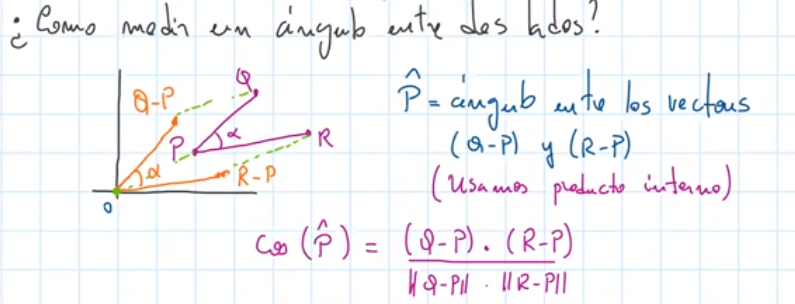
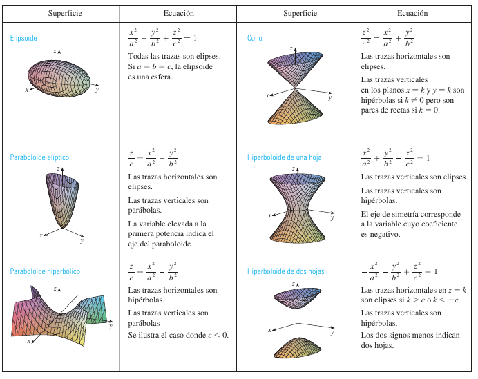

# Práctica 1

## Vectores y Geometría del espacio

### Distancia entre dos puntos

* Teorema de Pitágoras:
	
	
	$$
	d^2 = (a_2 - a_1)^2 + (b_2 - b_1)^2
	$$

+ DEF *dist(P, Q):* $\sqrt{(a_1-a_2)^2 + (b_1 - b_2)^2}$

### Círculos y Discos

* $P_0 = (a_0, b_0)$ ; $P = (x, y)$; $r > 0$

  El círculo de centro $P_0$ y radio r es el conjunto de todos los puntos P tales que $dist(p, p_0) = r$

$$
(x-a_0)^2 + (y-b_0)^2 = r^2
$$

### Vectores

* Longitud: $\sqrt{a^2 + b^2 + c^2}$

  Si a es un vector no nulo, busco un vector de igual longitud y sentido de longitud 1. 
  $$
  u = \frac{a}{|a|}
  $$

### Producto interno

$$
a, b \in \R^2 \lor \R^3 \newline
a \cdot b\newline
a = <x_1, y_1, x_1>\newline
b = <x_2, y_2, z_3>\newline
a \cdot b = x_1*x_2 + y_1*y_2+z_1+z_2
$$

##### Propiedades:

* $a*a = |a| ^2$
* $a*b = b*a$
* $a*(b+c) = a*b + a*c$
* $(ta)*b = t(a*b)$

### Teorema del coseno

$$
c^2 = a^2 + b^2 - 2 a b cos\theta
$$

$$
a \cdot b = |a||b|cos\theta
$$

donde $\theta$ es el ángulo más chico que forman los vectores.

##### Corolarios

* si $a, b \neq 0$

  * $$
    cos \theta = \frac{a\cdot b}{|a||b|}
    $$

* a y b ortogonales $\iff$ $a\cdot b = 0$

## 

# Práctica 2

## Rectas y planos

### Rectas en forma paramétrica

$$
\{\lambda v + P / \lambda \in \R\} = \lambda \cdot v^{\rightarrow} + P
$$

Recta con direccion $v^{\rightarrow}$ que pasa por P.

Ejemplo: $\lambda (2, 1) + (-1, 3)$

* Dirección: (2, 1)
* Pasa por P = (-1, 3)

**OBS**: La escritura no es única $\rightarrow$ Podemos cambiar v por cualquier múltiplo no nulo de v.

### Planos

#### Forma paramétrica

$$
\Pi : \lambda v^{\rightarrow} + \mu w^{\rightarrow} + P
$$

Plano que contiene las direcciones $v^{\rightarrow}$ y $w^{\rightarrow}$ y que pasa por P.

#### Forma implícita 

* Recta normal perpendicular a los dos vectores que dirigen el plano.
* La podemos hallar haciendo $N = v^{\rightarrow} \times w^{\rightarrow} $

>  **Nota**: Given $\vec{a} = \begin{pmatrix} a_1\\a_2\\a_3 \end{pmatrix}$ and
> $\vec{b} = \begin{pmatrix} b_1\\b_2\\b_3 \end{pmatrix}$
>
> Then their cross product $\vec{a} \times \vec{b}$ is defined
> $\vec{a} \times \vec{b} = (a_2b_3-a_3b_2)i + (a_3b_1-a_1b_3)j+(a_1b_2-a_2b_1)k$

 Con N y P podemos hallar la ec implícita de $\Pi$
$$
\Pi : N \cdot (x, y, z) = N \cdot P
$$
Si $N = (a, b, c) \rightarrow \Pi : ax + by + cz = d$

**Ejemplo**: Si $N = (2, -1, 3), P = (1, 1, -1) \rightarrow$

​		$\Pi: (2, -1, 3)(x, y, z) = (2, -1, 3)(1, 1, -1) \iff 2x -y +3z = -2$

# Teórica 3

## Producto vectorial

* Definido en $\R^3$

$$
a \times b = c \rightarrow\\
c \perp a \land c\perp b
$$

#### Propiedades:

* $a \times b \perp a$

  $a \times b \perp b$

* $a \times a = 0$

* $a \times b = - (b \times a)$

* $t \in \R, (ta)\times b = t (a\times b) \lor a \times (tb)$

* $a\times(b+c) = a\times b + a\times c$

  $(a + b)\times c = a\times c + b \times c$

* $a \cdot (b \times c) =(a \times b) \cdot c$

* $a\times (b \times c) = (a\cdot x)b - (a\cdot b)c$

#### Teorema

$$
|a \times b| = |a| |a| sen \theta
$$

donde $\theta$ es el ángulo entre a y b.

##### Corolarios

* $a\times b=0 \iff a \parallel b$
* $|a\times b| =$ área del paralelogramo generado por a y b

### Producto triple

$$
a, b, c \in \R^3
\\
a \cdot (b \times c) = (a\times b)\cdot c \\
\begin{vmatrix}
a_1 & a_2 & a_3\\
b_1 & b_2 & b_3\\
c_1 & c_2 & c_3
\end{vmatrix}
$$

El producto triple es calcular el determinante de la matriz.

Una interpretacion geómetrica sería hablar del volumen del paralelogramo con base $b\times c$, y de altura $a$.

En conclusion, el valor absoluto del determinante es el volumen del paralelepípedo generado por las filas de la matriz.

# Teórica 4

## Curvas

# Teórica 5

## Coordenadas polares

Dado un punto (x, y) puedo reescribirlo como $(r, \theta)$ donde r es la longitud desde el 0 y $\theta$ el ángulo desde el eje x.

Puedo pasar de coordenadas cartesianas a polares haciendo:
$$
x = r\ cos\ \theta\\
y = r\ sen\ \theta
$$
Y viceversa haciendo:
$$
r^2 = x^2 + y^2\\
tan\ \theta = \frac{y}{x}
$$
Entonces todo punto polar se puede escribir como $(r;\theta+ 2k\pi)$ o $(-r;\theta +(2k+1)\pi)$

### Curvas polares

Las curvas que se generan en ecuaciones que involucran a r y $\theta$.

##### Ejemplo:

* $r = 1 - cos(\theta)$

##  Curvas implícitas en R2

* Cónicas:
  * Elipse: $\frac{x^2}{a^2} + \frac{y^2}{b^2} = 1$
  * Circunferencia: $x^2 + y^2 = r^2$
  * Parábola: 
    * $y = ax^2$
    * $x = ay^2$
  * Hipérbole:
    * $\frac{x^2}{a^2} - \frac{y^2}{b^2} = 1$ 
    * $\frac{-x^2}{a^2} + \frac{y^2}{b^2} = 1$

Las cónicas son algunas curvas en $\R^2$ definidas de forma implícita. 
$$
\mathscr{C} = \{(x, y)\in \R^2 / F(x, y) = k\}
$$

 # Teórica 7

## Superficies en R3

# Teórica 8

## Límite y continuidad

### Funciones vectoriales

**DEF:** Una función vectorial es aquella cuyo argumento es un número real y su resultado un vector.
$$
r: I \subset \R \rightarrow \R^2 \lor \R^3\\
r(t) = <f(t), g(t), h(t)>
$$
Ejemplo: $r(t) = <cos\ t, sen\ t, t>$

Toda función vectorial es la parametrización de una curva.

#### Límite (para funciones vectoriales)

$$
r(t) = f(t) \hat{i} + g(t)\hat{j}+ h(t)\hat{k} 
$$

Se define:
$$
\displaystyle\lim_{t \to a} r(t) = <\displaystyle\lim_{t \to a}f(t), \displaystyle\lim_{t \to a} g(t), \displaystyle\lim_{t \to a} h(t)>
$$

#### Continuidad (para funciones vectoriales)

**DEF:** r(t) es continua en t=a si $\displaystyle\lim_{t \to a}r(t) = r(a)$

*OBS:* Es equivalente a que cada componente sea continua en t=a.

### Funciones de varias variables

**DEF:** Una función cuyo argumento es un punto de $\R^2$ o $\R^3$ y su resultado un número real.
$$
f: D \subset \R ^2 \lor \R ^3 \rightarrow \R\\
f = f(x, y) \lor f(x,y,z)
$$
Ejemplo: $f(x, y) = x^2 + 2y^2$

#### Límite (para funciones de varias variables)

Dado $\epsilon > 0$, existe $\delta>0$ tal que
$$
|f(x,y)- L| <\epsilon \ si\ 0 < \sqrt{(x-a)^2 + (y-b)^2}<\delta
$$

##### Lema de los límites iterados

Ejemplo:

##### Lema 2 (Aproximación por curvas)

Supongamos que $\displaystyle\lim_{(x,y) \to (a,b)} f(x,y) = L$;

Entonces para toda función vectorial r(t) tal que $\displaystyle\lim_{t \to t_0} r(t) = (a,b)$ se verifica que $ f(r(t)) = L$ 

##### Lemas varios útiles de límites

$$
\displaystyle\lim_{t \to 0} \frac{sen(t)}{t} = 1
$$

$$
\displaystyle\lim_{t \to 0} \frac{e^t -1}{t} = 1
$$

$$
\displaystyle\lim_{t \to 0} \frac{ln(1+t)}{t} = 1
$$

$$
\displaystyle\lim_{t \to 0} \frac{cos(t) -1}{t^2} = -1/2
$$

 # Teórica 9

## Continuidad

**DEF:** Sea $f:D \subset \R^2 \to \R$ y $(a,b) \in D$. Decimos que f es continua en (a, b) si:
$$
\displaystyle\lim_{(x,y) \to (a,b)} f(x,y) = f(a,b)
$$
Decimos que f es continua en D si es continua en todos los puntos de su dominio D.
